# 
夏樱乐团史（2023-2024）

## 序

&nbsp;&nbsp;&nbsp;&nbsp;&nbsp;&nbsp;&nbsp;&nbsp;严格的说其实应该从招新开始，客观地记录。  
&nbsp;&nbsp;&nbsp;&nbsp;&nbsp;&nbsp;&nbsp;&nbsp;这一段时间发生的故事，但是第一本人文笔很烂，第二脑子记不太住，第三纱橙靈实在是太可爱了，所以主观性地记录记录大事件，以及本人记得清的小事情，以及一些盘古开天辟地的故事（）

## P0--一个什么都不会的夏樱乐团团长

&nbsp;&nbsp;&nbsp;&nbsp;&nbsp;&nbsp;&nbsp;&nbsp;由于疫情影响，22 年漫协最大的活动冬日祭被迫延期，改为 23 年春日祭。（我的天哪什么年代了居然还能写出受疫情影响这种句子）23 年春日祭前后的夏樱乐团的活动情况不该由本人来叙述，但是不得不提的是，自从春日祭演出结束后，夏樱乐团失去了活力。当时活跃成员有瓜，inori，龙井，kyo，可能还有一些不认识的前辈（果咩），3 月之后大家再也没去过排练房，kyo 貌似也是在那段时间离开了夏樱乐团。  
&nbsp;&nbsp;&nbsp;&nbsp;&nbsp;&nbsp;&nbsp;&nbsp;漫协换届的时候，时任演音部部长六花来问纱橙靈要不要接任演音部，纱橙靈一个“考虑一下”就考虑了一周，等到确定的时候六花已经找到了烧烤。时任夏樱乐团团长龙井知晓此事后，就来问纱橙靈要不要接手夏樱乐团（明明之前说的是再当一年团长啊啊啊）。那时的纱橙靈什么乐器都不会，龙井告诉纱橙靈“**只要热爱就什么都可以做到！**”（具体的记不到也找不到了，大概就是这个意思叭）然后纱橙靈就阴差阳错地成为了夏樱乐团的新团长。

## P1--目标与构想

&nbsp;&nbsp;&nbsp;&nbsp;&nbsp;&nbsp;&nbsp;&nbsp;一个乐团，总得有人才会有演奏叭……所以当时纱橙靈给自己的目标就只是让乐团活起来，时不时地能凑出一两个演奏就好。鉴于去年（22 年）乐团缺鼓手（和主唱），纱橙靈暑假速成一个架子鼓，顺手在大群里拉了很多夏樱乐团的新人！虽然已经记不清上任时的群人数，估计最开始应该 80 人都不到吧，而且还有很多潜水的咕噜咕噜。最开始加入乐团的估计有十几个左右，其实很想把所有小伙伴名字都放上来但是怕漏一两个什么的所以干脆就一个都不放了（）。  
&nbsp;&nbsp;&nbsp;&nbsp;&nbsp;&nbsp;&nbsp;&nbsp;在这一年，其实有许许多多的管弦小伙伴加入乐团，对此纱橙靈想的是**作为一个乐团**，应该尽可能每次演出让更多的乐器能够上台，让更多的小伙伴能够上台演奏，在整个学年的活动安排中都没有放下过带管弦演奏的想法，可惜能力有限没能弄好...对于传统的电声乐器，截至百团大战前吉他键盘鼓和贝斯都有，但是没有主唱...这会在后面一章提到我们先不提这个，重要的是乐团的运作模式。按照以往的形式，就是凑够人就上，没有固组，又由于纱橙靈也是刚刚才开始接触乐器，对演奏方面没有充足的认识，只能从现有制度基础上改造，于是出现了一个特别天才的想法：**投票决定每次的演奏曲目，然后在线表格填表**，这样不仅能解决不同乐器之间不平衡的比例关系，也能让大家根据自己的时间安排自己在乐团的活动，而且也可以保证演奏的歌曲都是大家比较喜欢的曲目。  
&nbsp;&nbsp;&nbsp;&nbsp;&nbsp;&nbsp;&nbsp;&nbsp;现在看来这些东西确实有些理想化了，但是没办法这还只是一个不懂音乐的人带着盘活乐团的抱负干的第一件傻事嘿嘿...

## P1.5--开学饭

&nbsp;&nbsp;&nbsp;&nbsp;&nbsp;&nbsp;&nbsp;&nbsp;不要问为什么吃饭也能单开一章，但是吃饭对于夏樱乐团非常重要，就是能单开一章。  
&nbsp;&nbsp;&nbsp;&nbsp;&nbsp;&nbsp;&nbsp;&nbsp;为什么选在顶屋，因为 22 年也是在顶屋。此顶屋非彼顶屋，这家在未来城，而不是东湖新村的顶屋哦。  
&nbsp;&nbsp;&nbsp;&nbsp;&nbsp;&nbsp;&nbsp;&nbsp;不知道为什么本人看到这张图就想起 22 年吃顶屋的时候，龙井还被困在海南来不了武汉，和那时的米娜开视频通话...  
&nbsp;&nbsp;&nbsp;&nbsp;&nbsp;&nbsp;&nbsp;&nbsp;图像拍摄于 2023 年 9 月 18 日（应该吧）。从左至右依次是：纱橙靈、芝士、灰灰（前）、热心市民（后）、瓜、zeit、怀苍、龙井、烛木、kuro、剑语。

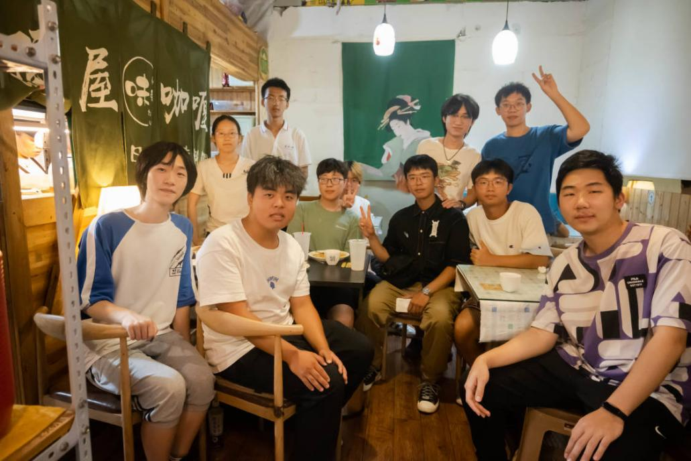

## p2--百团大战

&nbsp;&nbsp;&nbsp;&nbsp;&nbsp;&nbsp;&nbsp;&nbsp;众所周知百团大战有个舞台，能演（超绝简介）。今年也有这个机会。还在暑假期间群内就已发起投票，投票结果为茂桑最喜欢的《**届かない恋**》，乐手从左至右为：ba.芝士、gt.怀苍、key.剑语、vo.羊山、gt.灰灰、dr.纱橙靈。

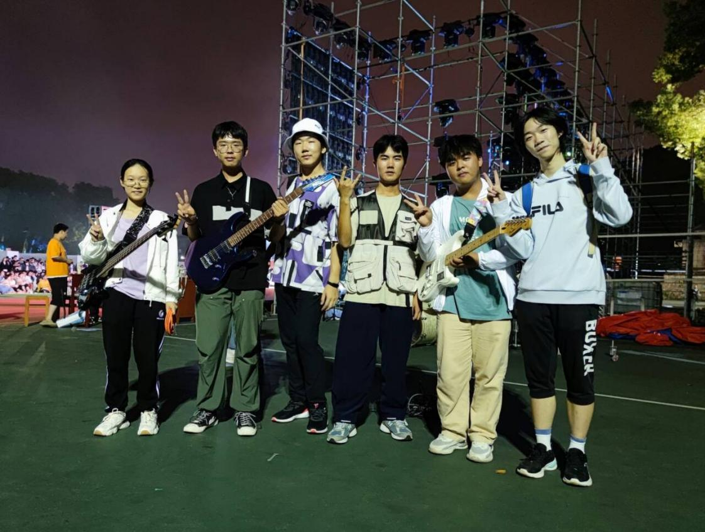

&nbsp;&nbsp;&nbsp;&nbsp;&nbsp;&nbsp;&nbsp;&nbsp;放这个可能大家伙不认识，但是下面这张图应该就很熟悉了（）  

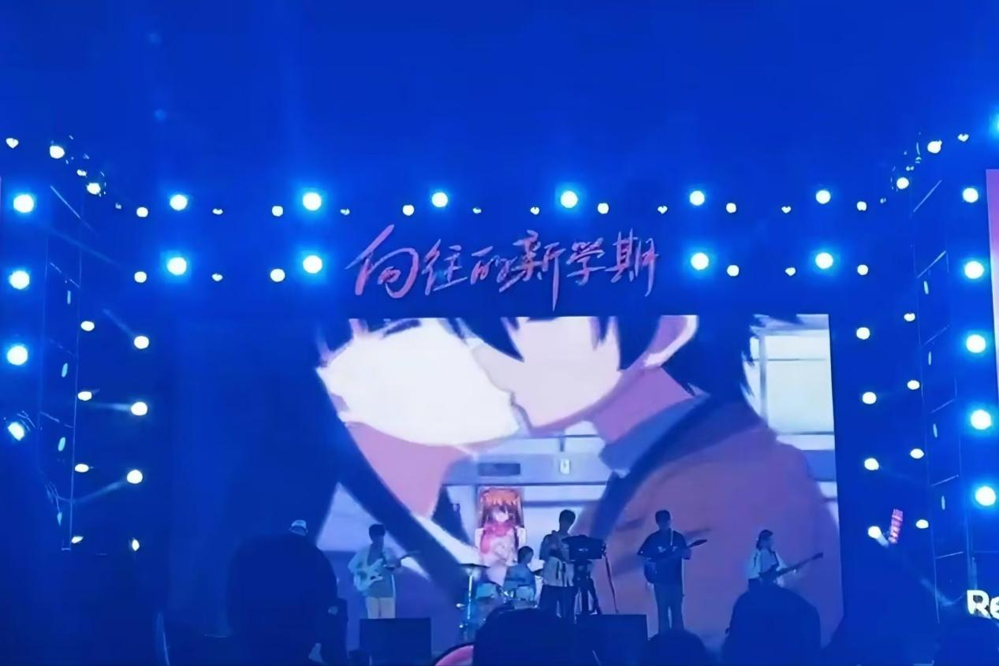

&nbsp;&nbsp;&nbsp;&nbsp;&nbsp;&nbsp;&nbsp;&nbsp;在这次企划中，很快啊，乐器就凑齐了，但是没有主唱...然后有了羊山。这是羊山截至写稿的唯一一次演出，乐团的很多小伙伴估计都不认识了，在这场演出后他选择了深藏功与名原地退休...虽然是原调降八度，但是架不住漫协小伙伴的热情，现场氛围非常棒。这次演出录像也上传至夏樱乐团 B 站官号，然后非常神奇地火了。  
&nbsp;&nbsp;&nbsp;&nbsp;&nbsp;&nbsp;&nbsp;&nbsp;当然这是晚上的晚会了，遗憾的是日场没有出摊能力，被旁边吉协独占鳌头，要是百团日场也能有演奏就好了！

## p3--迎新晚会

&nbsp;&nbsp;&nbsp;&nbsp;&nbsp;&nbsp;&nbsp;&nbsp;话不多说，经投票决定，迎新晚会演出企划定为《**光るなら**》，乐手从左向右依次为：萨克斯：Animnia、小提琴：INFINITY、gt.怀苍&clover、ba.芝士、key.剑语。

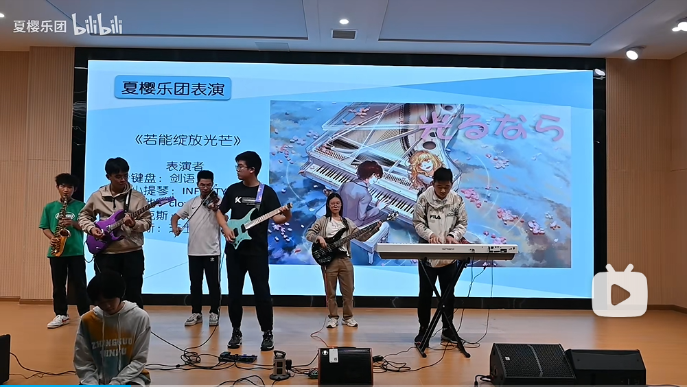

&nbsp;&nbsp;&nbsp;&nbsp;&nbsp;&nbsp;&nbsp;&nbsp;从企划敲定到正式演出，只合了两遍，大多时候是节奏对不齐，因此在表演当天临时决定加入一个节奏乐器，于是就有了纱橙靈在台子上面敲箱子这档子事）  
&nbsp;&nbsp;&nbsp;&nbsp;&nbsp;&nbsp;&nbsp;&nbsp;这次演出与先前不同，在传统电声乐器之中融入了两个管弦乐器，除了管弦乐器没办法插电用音响所以声音比较小以外，其实编排出来真的很好听的，在此也感谢两位先驱在乐团作为一个“乐团”而演出付出的努力。

## p3.5--政治任务

&nbsp;&nbsp;&nbsp;&nbsp;&nbsp;&nbsp;&nbsp;&nbsp;因为有借用排练房，所以排练房这边有个要求就是要有一首曲目的存款充当政治任务，在学校需要的时候随时能拿出来演奏。限制中文，于是投票决定了《**再飞行**》。乐手定为：gt.灰灰、dr.热心市民、gt.烛木&怀苍、key.剑语，虽然**没合着排过也没演过**（）

<h2 id="drj">p4--冬日祭</h3>

&nbsp;&nbsp;&nbsp;&nbsp;&nbsp;&nbsp;&nbsp;&nbsp;冬日祭没投票了，转而是**发起制**，最终确定上台 3 个节目。  
&nbsp;&nbsp;&nbsp;&nbsp;&nbsp;&nbsp;&nbsp;&nbsp;《**春日影**》，从左至右依次为：ba.芝士、vo.碎月、dr.纱橙靈、key.inori、gt.瓜。

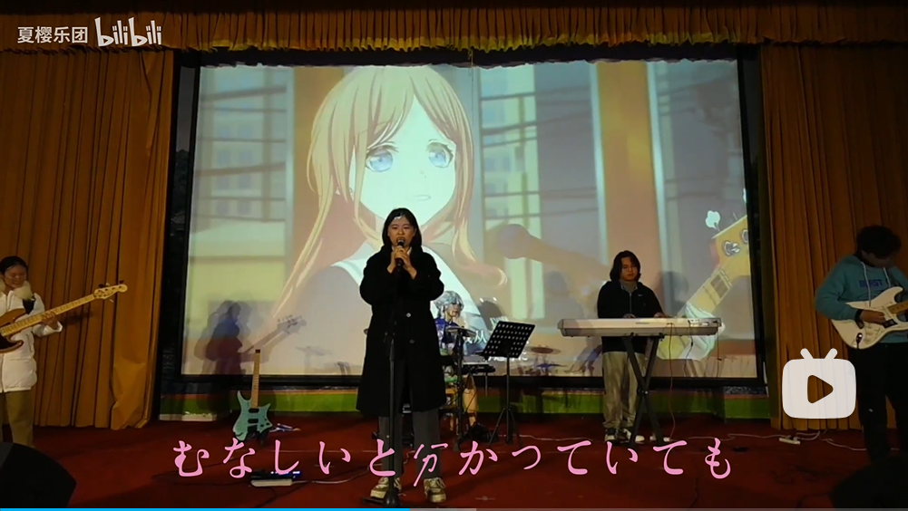

&nbsp;&nbsp;&nbsp;&nbsp;&nbsp;&nbsp;&nbsp;&nbsp;《**迷星叫**》，从左至右依次为：ba.芝士、gt.怀苍、dr.热心市民、vo.烧烤、gt.灰灰。  
&nbsp;&nbsp;&nbsp;&nbsp;&nbsp;&nbsp;&nbsp;&nbsp;烧烤这身打扮记得好像是致敬前一年春日祭大合唱领唱的 kyo。  

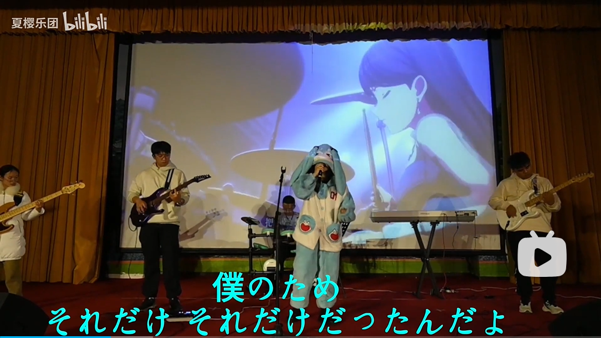

&nbsp;&nbsp;&nbsp;&nbsp;&nbsp;&nbsp;&nbsp;&nbsp;《**don't say lazy**》，从左至右依次为：（屏幕外）ba.芝士、gt.clover、vo.伊伊、dr.夜璃、key.剑语、gt.灰灰  

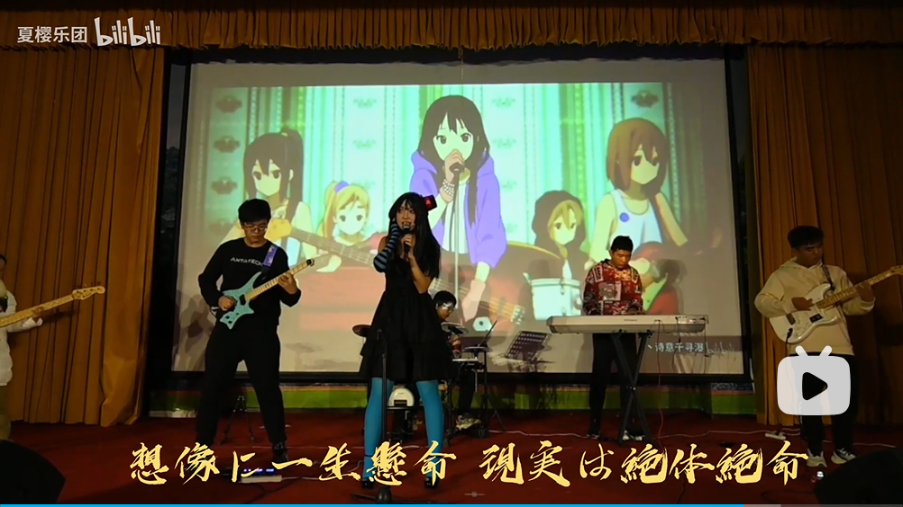

 

&nbsp;&nbsp;&nbsp;&nbsp;&nbsp;&nbsp;&nbsp;&nbsp;整个演出过程由于是组队演一首歌，为了尽可能避免设备插拔导致过场时间过久，经过了乐团群内**精心设计上下场顺序以及站位**（而且还有纱橙靈在台子上唠嗑），倒也是别的演出品味不到的乐趣了hh  
&nbsp;&nbsp;&nbsp;&nbsp;&nbsp;&nbsp;&nbsp;&nbsp;演出失误是难免的，更何况是刚复苏的夏樱乐团，最严重的失误应该就是 dsl 的开头了吧（笑）。演奏结束以后去了老街烧烤吃夜宵。  
&nbsp;&nbsp;&nbsp;&nbsp;&nbsp;&nbsp;&nbsp;&nbsp;值得一提的是，现在各位熟知为幻音祭主办之一的夏乐在这次冬日祭也特别来到现场，带着他的小伙伴一起观看了这次演出，真是有朋自远方来（很可惜在他们办演出的时候本人都比较忙）。随后也去了老街烧烤吃夜宵（也很可惜没有大桌子没坐到一桌上）。

_&nbsp;&nbsp;&nbsp;&nbsp;&nbsp;&nbsp;&nbsp;&nbsp;以上就是 23-24 年度上半学期的所有乐团活动了，收拾整理一下才发现原来我们干了这么多事......这么一看好像下半学期确实没啥活动了......吗？_

## p4.5--pjsk 专场

&nbsp;&nbsp;&nbsp;&nbsp;&nbsp;&nbsp;&nbsp;&nbsp;记不清什么时候了，有个 24 年 pjsk only 的主办通过外联找到夏樱乐团，希望能有 pjsk 相关的专场演出。当时就很犯难，因为曲库中没有一个与 pjsk 相关，更何况起步需要三首，到时候场地也不提供架子鼓（这个倒是次要）。接是暂时接下了，人也确定了，但是好像一直没启动。估计是主办那边看我们这边两三个月都没动静，然后就不要了（笑）
&nbsp;&nbsp;&nbsp;&nbsp;&nbsp;&nbsp;&nbsp;&nbsp;虽然没觉得很可惜但是还是觉得很可惜，毕竟是难得有校外的演出找我们合作，只是确实机会没抓住了罢。不过这一次也是暴露了组队演出的弊端，应对除漫协内演出的时候难以规划，而且很多演出也不太接受演出过程中换人的操作，许多小伙伴在这个时候提出了“**固组**”的想法。

## p4.75--接龙尝试

&nbsp;&nbsp;&nbsp;&nbsp;&nbsp;&nbsp;&nbsp;&nbsp;募集表中其实还有一栏神奇的企划，就是**歌曲创作接龙**。记得当时好像是乐团新进一个小伙伴会编曲，然后群里就聊起接龙的想法，聊得火热，然后纱橙靈顺手扔上募集企划表，就像绘画接龙一样分个接力顺序，结果最后一个人都没有......其实还是挺好奇好多人接龙创作出来的歌曲会长什么样子，而且貌似确实可以作为以后乐团的某项活动，所以记录于此。

## p5--春日迷影

&nbsp;&nbsp;&nbsp;&nbsp;&nbsp;&nbsp;&nbsp;&nbsp;冬日祭后，瓜说没演够还想演，**看了看社团经费发现还剩个小两千**，然后有了春日迷影（社长的大手.jpg）  
&nbsp;&nbsp;&nbsp;&nbsp;&nbsp;&nbsp;&nbsp;&nbsp;春日迷影，取名自 23 年出圈的动漫《BanG Dream It's MYGO》中歌曲《春日影》（不知道过个几年几十年还有没有 go），其初衷是为了**给乐团提供一个专场演出的舞台，同时弥补漫协下半年没有大型活动的缺陷**。这一次也是漫协第一届乐团路演活动，也是第一个由夏樱乐团主办的大型活动（其实是太太上皇瓜主办，本人安顿伙食去了）  
&nbsp;&nbsp;&nbsp;&nbsp;&nbsp;&nbsp;&nbsp;&nbsp;从 25 年回来的本人表示，由于乐团结构的改变，现今乐团路演本质上就是乐团乐队专场演出，但是我们知道那个时候的纱橙靈只会投票和发起投票，乐团自身出不了那么多节目支撑整场活动，于是邀请了一些校外乐队：残响、One Week、葉羽、废萌泄露，关于校外乐队的演奏可以移步 B 站漫协官号观看完整录像，下面只介绍乐团的演出。  
&nbsp;&nbsp;&nbsp;&nbsp;&nbsp;&nbsp;&nbsp;&nbsp;《**夏霞**》，从左至右依次为：gt.clover、vo.碎月、ba.萌鸽、dr.热心市民、gt.灰灰、key.inori。

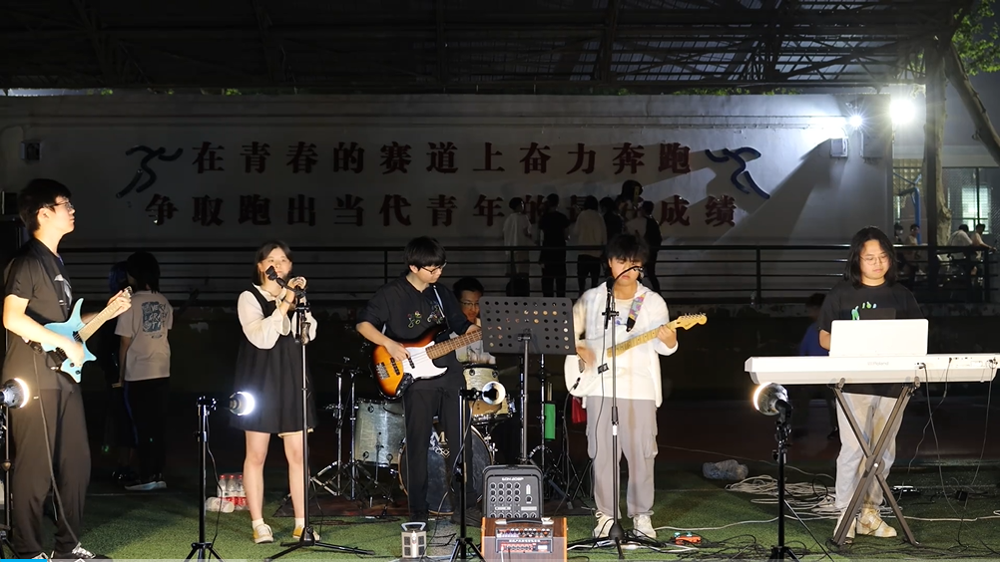  

&nbsp;&nbsp;&nbsp;&nbsp;&nbsp;&nbsp;&nbsp;&nbsp;《**春日影**》，配置同[冬日祭](#drj)。

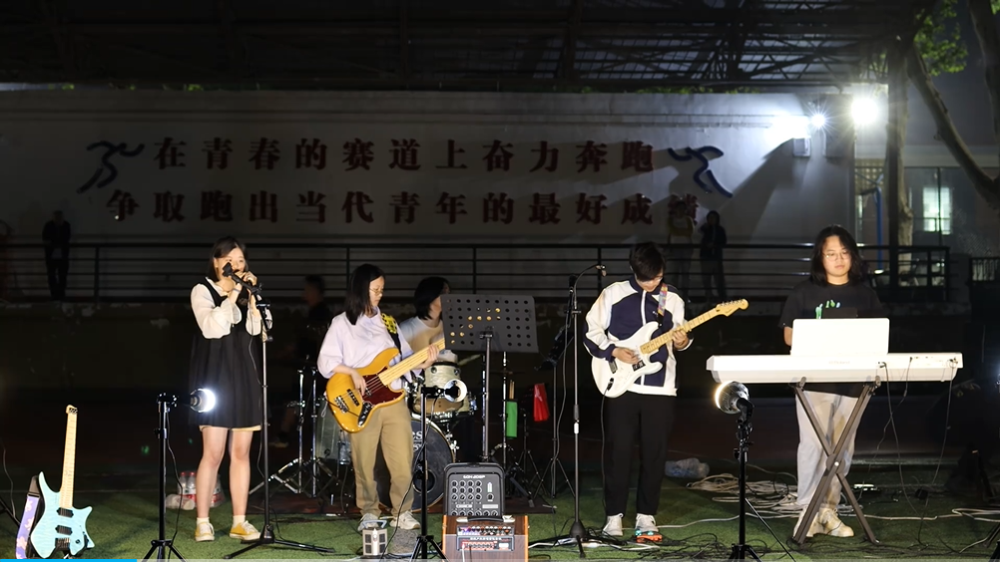

&nbsp;&nbsp;&nbsp;&nbsp;&nbsp;&nbsp;&nbsp;&nbsp;《**メフィスト**》，从左至右依次为：gt.clover、vo.QuQ、ba.烛木、dr.热心市民、vo.纱橙靈、gt.灰灰、key.不夜星、vn.INFINITY。

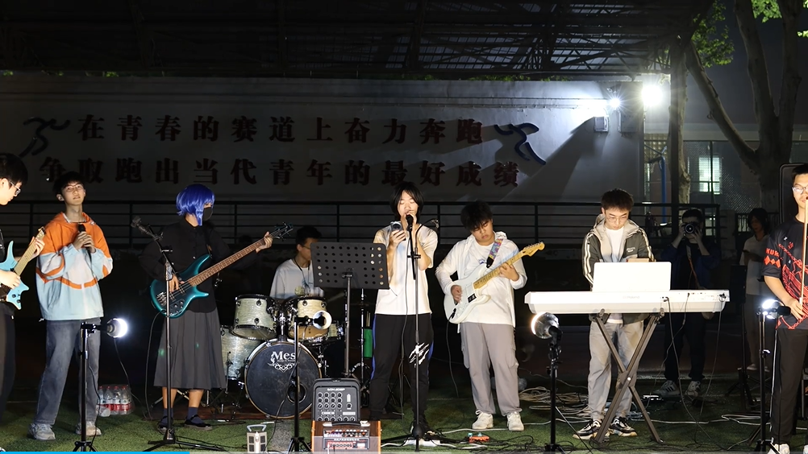

 

&nbsp;&nbsp;&nbsp;&nbsp;&nbsp;&nbsp;&nbsp;&nbsp;《**老人と海**》，从左至右依次为：gt.clover、ba.烛木、dr.纱橙靈、vo.（我不认识，好像是乐团之外的）、gt.灰灰。

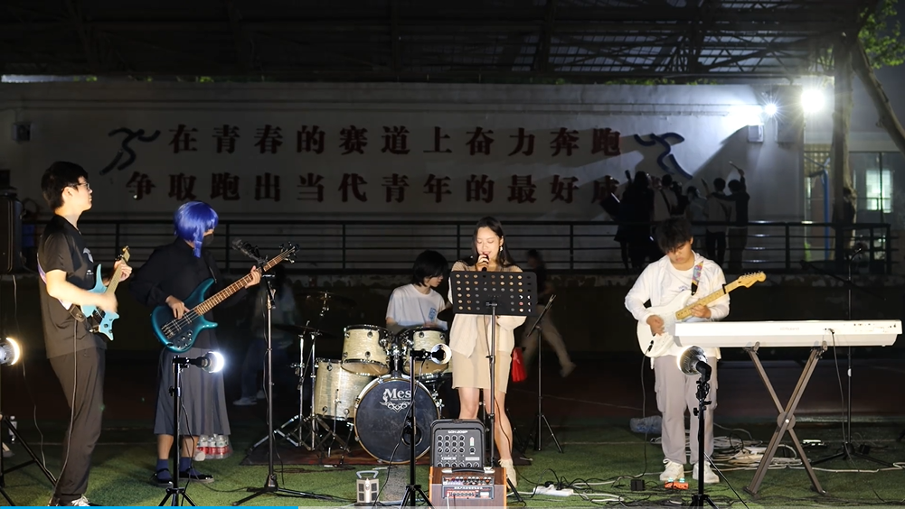

&nbsp;&nbsp;&nbsp;&nbsp;&nbsp;&nbsp;&nbsp;&nbsp;《**僕のこと**》，从左至右依次为：vo.六花、key.inori

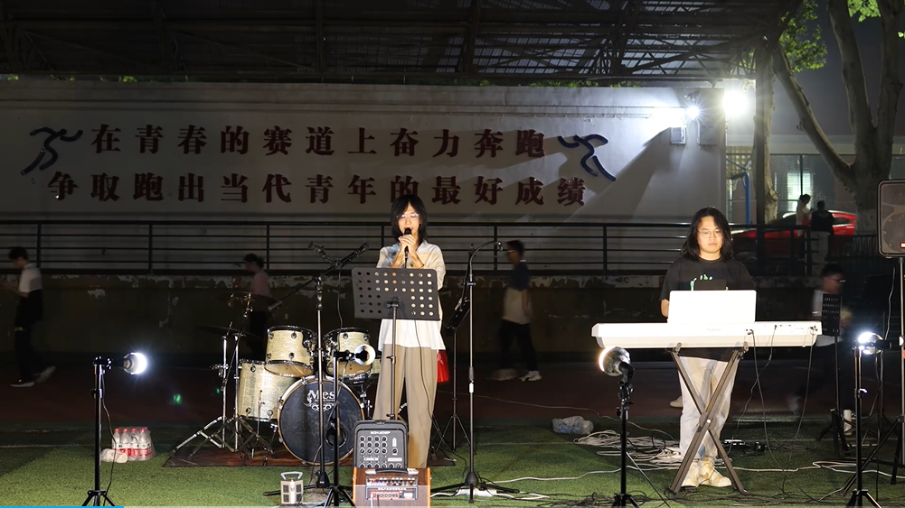

&nbsp;&nbsp;&nbsp;&nbsp;&nbsp;&nbsp;&nbsp;&nbsp;这次的演出除了纱橙靈唱得报听真的都超棒的，收获了内外一致好评。但是用夏樱乐团官号分 p 发 B 站的时候因为标题没取好被人骂了，后面两首曲目就没有再上传至乐团官号，但是**在漫协官号上有完整录像**。  
&nbsp;&nbsp;&nbsp;&nbsp;&nbsp;&nbsp;&nbsp;&nbsp;再多提一句，有人报了企划但是不练琴也不吱声，是谁已经不重要了，重要的是希望大家记住不练琴会被群起而攻之（）

## p6--武大制噪

&nbsp;&nbsp;&nbsp;&nbsp;&nbsp;&nbsp;&nbsp;&nbsp;这是每年学校青鸟吉协举办的大型摇滚音乐节，所有的校内乐队都有机会登上这个梅园小操场的舞台，尽情释放噪声，然后上小红书（）  
&nbsp;&nbsp;&nbsp;&nbsp;&nbsp;&nbsp;&nbsp;&nbsp;登上制噪的舞台一直是大家所有人的梦想（吧），就算要求至少 20min 的曲目，当时的大家也都有所安排，只可惜一方面是实力不太够，另一方面是轮番切人的操作确实不适合这种大型演出吧，最后遗憾落选。

## p7--新的一届

&nbsp;&nbsp;&nbsp;&nbsp;&nbsp;&nbsp;&nbsp;&nbsp;本人的任务就到这里，虽然没有能带大家上到不管是幻音祭或者武大制噪的大舞台，乐团的大部分活动也是太上皇在主持操办，但是本人对自己的目标认识还是非常的清晰：就是简简单单**把乐团炒活**，实际上这一点也确确实实做到了，接下来只剩下交接班的事了。  
&nbsp;&nbsp;&nbsp;&nbsp;&nbsp;&nbsp;&nbsp;&nbsp;其实很早以前就想把夏樱乐团交接给灰灰，但是不知道在哪里听到的风声说灰灰组了一队固组，担心会没有心思再来照顾乐团，而且也**有点醋醋的感觉**，稍微犹豫了一段时间，然后找龙井交流了一下，发现是个误会...然后鼓气勇气找到灰灰，很开心也很感谢灰灰能那么爽快地答应下来，随后**夏樱乐团新的纪元**随灰灰的大手铺展开了。

## 结语

&nbsp;&nbsp;&nbsp;&nbsp;&nbsp;&nbsp;&nbsp;&nbsp;比较残念的是在这一年没和大家吃多少饭，这有个记不得是什么时候吃的饭（说是圣诞节），但是人很多，那就放在最后吧。(自己认领吧我就懒得写谁是谁了)

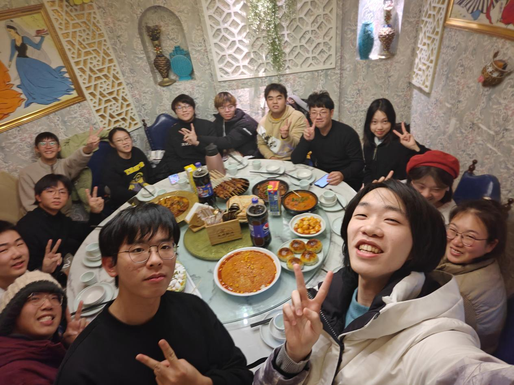

&nbsp;&nbsp;&nbsp;&nbsp;&nbsp;&nbsp;&nbsp;&nbsp;感谢看到这里的小伙伴，也感谢在夏樱乐团活跃的每一个小伙伴，之后的故事就交给大家一起继续书写了，**希望大家在夏樱乐团能组一辈子乐队！**
